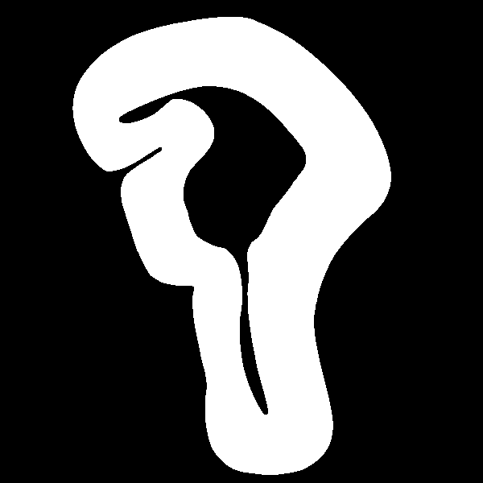
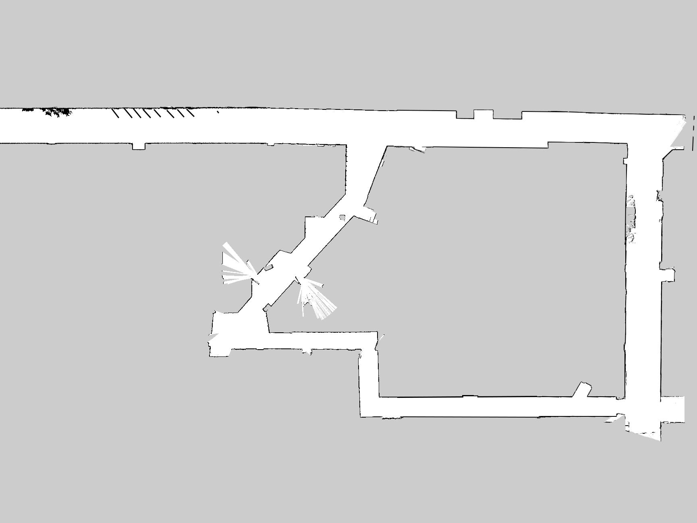
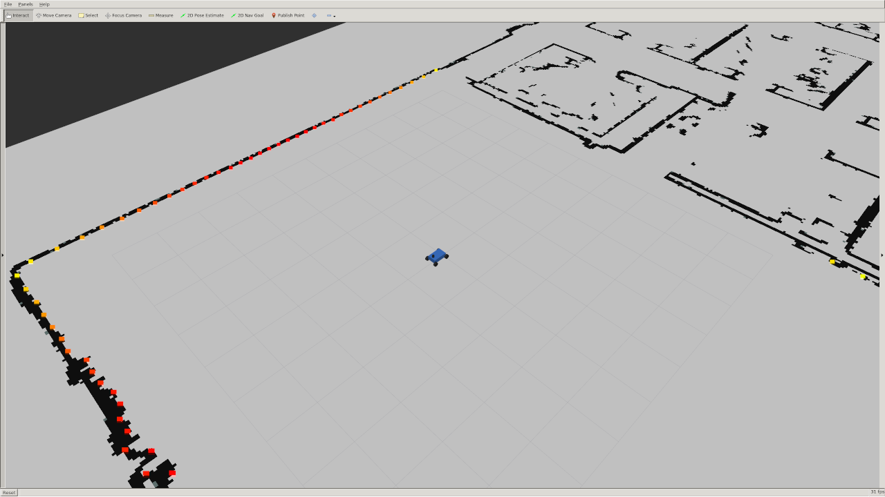
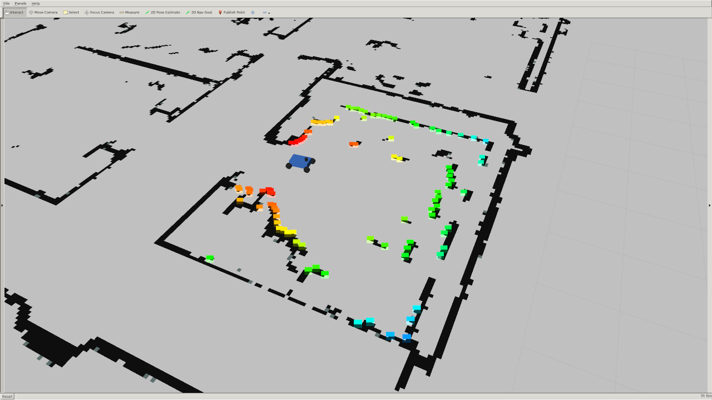

# Autonomous Electric Vehicle Project

A comprehensive, semester-long engineering project to design, implement, and validate a full-stack autonomous vehicle system. This repository documents the complete development lifecycle—from embedded Linux configuration and ROS integration to sensor fusion, state estimation, and model-predictive control—culminating in a functional autonomous vehicle capable of real-time environment perception and navigation.

  <table>
    <tr>
      <td align="center"> Smooth hallway traversal</td>
      <td align="center"> Obstacle avoidance in motion</td>
    </tr>
  </table>

<!-- 

  <table>
    <tr>
      <td align="center"> Smooth hallway traversal</td>
      <td align="center"> Obstacle avoidance in motion</td>
    </tr>
  </table>

 -->

<!-- 

  

      

 -->

*The MacAEV navigating autonomously using a virtual barriers algorithm with Quadratic Programming optimization, successfully following a hallway and avoiding obstacles.*

---

## Table of Contents
1. [🎯 Purpose & System Architecture](#-purpose--system-architecture)
2. [🛠️ Hardware Platform & Software Stack](#%EF%B8%8F-hardware-platform--software-stack)
3. [⚙️ Technical Deep Dive: Algorithms & Implementation](#%EF%B8%8F-technical-deep-dive-algorithms--implementation)
    - [Motor Control & Characterization](#motor-control--characterization)
    - [Sensor Integration & Calibration](#sensor-integration--calibration)
    - [State Estimation & Localization](#state-estimation--localization)
    - [Mapping & Environment Perception](#mapping--environment-perception)
    - [Autonomous Navigation & Control](#autonomous-navigation--control)
4. [🏁 Final System Performance](#-final-system-performance)
5. [📚 Technical Skills & Competencies](#-technical-skills--competencies)
    - [Software Engineering & Systems Architecture](#software-engineering--systems-architecture)
    - [Robotics & Control Theory](#robotics--control-theory)
    - [Embedded Systems & Hardware Integration](#embedded-systems--hardware-integration)
    - [Data Science & Algorithmic Thinking](#data-science--algorithmic-thinking)
    - [Engineering Project Management](#engineering-project-management)
6. [🔭 Future Work & Optimization](#-future-work--optimization)
7. [🙏 Acknowledgements](#-acknowledgements)

---

## 🎯 Purpose & System Architecture

The primary objective of this project was to architect and implement a complete autonomous vehicle software stack, from bare-metal motor control to high-level planning and decision-making. This involved integrating a heterogeneous set of sensors and actuators, developing real-time state estimation algorithms, and implementing robust control strategies for navigation in unknown environments.

**System Architecture Overview:**
The vehicle's software architecture follows a modular, ROS-based pipeline:

1.  **Perception Layer:** RPLiDAR (2D laser scanner) and BNO055 IMU provide raw environmental and state data.
2.  **State Estimation Layer:** Fuses IMU and wheel odometry data to provide a robust estimate of the vehicle's pose (`x`, `y`, `yaw`) in the world frame.
3.  **Mapping Layer:** Builds a 2D occupancy grid map of the environment using inverse sensor models and Bayesian filtering.
4.  **Planning & Control Layer:** Implements high-level behaviors (e.g., virtual barriers path planning) and low-level control (feedback-linearized PD control) to generate actuator commands.
5.  **Actuation Layer:** VESC motor controller executes speed and steering angle commands with Field-Oriented Control (FOC).

## 🛠️ Hardware Platform & Software Stack

### Vehicle Platform (MacAEV)
The McMaster AEV is a custom-built, rear-wheel-drive differential-steer platform designed for indoor autonomy research.

| Component | Specifications | Role |
|-----------|----------------|------|
| **Jetson Nano** | ARM Cortex-A57, 4GB RAM, 128-core Maxwell GPU | Main onboard computer for perception, planning, and control. |
| **VESC 6** | STM32F4 MCU, DRV8301 gate driver, 60A continuous current | Sensorless Field-Oriented Control (FOC) of the BLDC motor. |
| **RPLiDAR A2M8** | 360° laser scanner, high sample rate, 12m range, 10Hz rotation | 2D environment perception and obstacle detection. |
| **BNO055 IMU** | 9-DOF (Accel, Gyro, Mag) with internal sensor fusion | Provides absolute orientation (quaternion) for robust odometry. |
| **Logitech F710** | 2.4GHz wireless gamepad | Human-machine interface for manual control and mode switching. |
| **LiPo Battery** | 3S 11.1V, 2200mAh | Primary power source for the entire system. |

### Software Stack & Development Tools
- **Operating System:** Ubuntu 18.04 LTS (on Jetson Nano)
- **Middleware:** ROS Melodic (Robot Operating System) with `catkin` build system
- **Programming Languages:** C++17 (performance-critical nodes), Python 3 (rapid prototyping)
- **Key Libraries & Dependencies:**
    - `vesc_driver`: ROS driver for VESC communication
    - `rplidar_ros`: ROS driver for RPLiDAR
    - `tf2_ros`: ROS coordinate transform library
    - `quadprog`: Quadratic Programming solver for optimization problems
    - `Eigen`: Linear algebra library for C++
- **Simulation:** F1TENTH Simulator (Gazebo-based)
- **Debugging & Profiling:** `rqt_graph`, `rqt_plot`, `rostopic`, `rosnode`, `rviz`

## ⚙️ Technical Deep Dive: Algorithms & Implementation

### Motor Control & Characterization
- **Field-Oriented Control (FOC):** The VESC controller operates in speed mode, using FOC to independently control the `q`-axis (torque-producing) and `d`-axis (flux-producing) currents, with `Id` maintained at zero for maximum torque efficiency.
- **PID Tuning:** The speed controller was empirically tuned to achieve a balance between rise time, overshoot, and steady-state error. The closed-loop system was analyzed through its transfer function:
  $H_{cl}(s) = \frac{K_p}{s^2 + K_d s + K_p}$
  where $K_p$ and $K_d$ govern the system's natural frequency and damping ratio.
- **Motor Characterization:** Conducted speed and duty cycle sweeps to map the system's response. Key relationships were observed:
    - **RPM vs. Duty Cycle:** A linear relationship, characterized by a gain constant (`speed_to_erpm_gain`).
    - **Current (I_q) vs. Speed:** An inversely proportional relationship due to back-EMF.
    - **Braking Dynamics:** Characterized the `Stop` (open-circuit) vs. `Brake` (short-circuit) behaviors, observing that applying a brake current command creates a negative q-axis current, acting as a generator to dissipate kinetic energy.

### Sensor Integration & Calibration
- **Coordinate Frame Management (`tf2`):** Defined and published static transforms between `base_link`, `laser`, and `imu` frames using a consistent `right-hand` rule convention. The transforms were derived from measured physical offsets and rotation matrices:
  $T_{laser}^{base\_link} = \begin{bmatrix} R & t \\ 0 & 1 \end{bmatrix}$
- **IMU Quaternion Processing:** The BNO055 IMU publishes orientation as a quaternion ($q_w, q_x, q_y, q_z$). This was converted to a rotation matrix to extract the yaw angle:
  $\theta = \text{atan2}(2(q_w q_z + q_x q_y), 1 - 2(q_y^2 + q_z^2))$
- **LiDAR Data Reprocessing:** Implemented a `laser_callback()` in `experiment.cpp` that rotates the LiDAR data by $180^\circ$ (π radians) to align the RPLiDAR's forward direction with the `base_link` frame. This involved swapping halves of the `ranges` and `intensities` arrays.

### State Estimation & Localization
- **Wheel Odometry:** Implemented a dead-reckoning system using the vehicle's kinematic model (Ackermann steering). The pose update equations were:
  $x_{k+1} = x_k + v_s \cdot \Delta t \cdot \cos(\theta_k)$
  $y_{k+1} = y_k + v_s \cdot \Delta t \cdot \sin(\theta_k)$
  $\theta_{k+1} = \theta_k + \frac{v_s}{l} \cdot \tan(\delta) \cdot \Delta t$
- **IMU-Augmented Odometry:** To mitigate drift from the kinematic model, the IMU yaw measurement replaced the calculated $\theta$ from the kinematic integration. This provides a more accurate and stable heading estimate, essential for long-term navigation.
- **Euler Integration:** Implemented discrete-time integration using a fixed time step ($\Delta t$) from VESC state messages.

### Mapping & Environment Perception
- **Occupancy Grid Mapping:** Developed a Python node implementing the standard occupancy grid mapping algorithm.
- **Inverse Sensor Model:** For each LiDAR scan, cells are classified as:
    - **Occupied:** If the LiDAR beam endpoint falls within the cell ($p_{occ}$).
    - **Free:** If the cell lies between the sensor and an obstacle ($p_{free}$).
    - **Unknown:** All other cells ($p_{un}$).
- **Bayesian Log-Odds Update:** Cell occupancy probabilities are updated recursively using log-odds:
  $l_{k} = l_{k-1} + l_{inv\_sensor} - l_{prior}$
  where $l_{inv\_sensor}$ is the log-odds of the inverse sensor model and $l_{prior}$ is the prior log-odds.
- **Map Parameters:** The map was configured with a grid resolution, width, and height appropriate for the environment.

### Autonomous Navigation & Control

#### Line-Following Algorithm
- **Feedback Linearization:** The steering angle command $\delta$ is computed to linearize the nonlinear vehicle dynamics:
  $\delta = \text{atan}\left(\frac{-l}{v_s^2(\cos\alpha_r + \cos\alpha_l)}(-K_p \tilde{d}_{lr} - K_d \dot{d}_{lr})\right)$
  where $\tilde{d}_{lr}$ is the error between desired and actual distances to the left and right walls, and $\alpha_l$, $\alpha_r$ are the angles to the walls.
- **PD Control:** The resulting closed-loop system behaves as a standard second-order system:
  $\ddot{d}_{lr} + K_d \dot{d}_{lr} + K_p d_{lr} = K_p d_{lr}^{des}$
  Allowing for independent tuning of the damping ratio ($\zeta = \frac{K_d}{2\sqrt{K_p}}$) and natural frequency ($\omega_n = \sqrt{K_p}$).

#### Virtual Barriers Algorithm
- **Gap Detection:** Identifies the largest obstacle-free gap in the LiDAR scan within a defined field of view. The vehicle's desired heading is set toward the furthest point in this gap.
- **Quadratic Programming (QP) for Barrier Lines:** Formulates and solves a QP to find two parallel lines that separate the vehicle from obstacles while maximizing the corridor width:
  $\min_{w,s} \frac{1}{2} w^T w$
  subject to:
  $w^T p_i + s \ge 1$ (right-side obstacles)
  $w^T p_j + s \le -1$ (left-side obstacles)
  $-1 + \epsilon \le s \le 1 - \epsilon$
  The distance between the lines is $d = \frac{2}{\sqrt{w^T w}}$, which is maximized by minimizing $w^T w$.
- **Solver:** Used the `quadprog` library, implementing Goldfarb and Idnani's active set method for solving convex QPs.

## 🧪 Simulation & Algorithm Development

Before deploying on the physical vehicle, all algorithms were rigorously tested in the F1TENTH simulation environment. This allowed for rapid iteration and parameter tuning without risking hardware damage.

### Environment Mapping & Occupancy Grid

The occupancy grid mapping algorithm was first validated in simulation. The following image shows the grid-based map generated using log-odds Bayesian updates from simulated LiDAR scans.

  

*Figure: Occupancy grid map generated in simulation using log-odds Bayesian updates.*

### Virtual Wall-Following & Line Barrier Algorithms

Two autonomous navigation strategies were developed and tested:

1. **Wall-Following (Distance-Based):** A feedback-linearized PD controller that maintains the vehicle centered between two walls by tracking the distances to the left and right walls.

2. **Virtual Barriers (QP-Based):** An advanced algorithm that formulates and solves a Quadratic Programming problem to find two parallel lines that maximize the safe corridor while separating the vehicle from obstacles.

Both algorithms were tested on various simulated maps:

  <table>
    <tr>
      <td align="center"> Berlin map - urban environment testing</td>
      <td align="center"> Stata Basement map - indoor corridor testing</td>
    </tr>
  </table>

### LiDAR Perception & Real-Time Visualization

The simulation environment provided real-time visualization of the vehicle's perception system. The colorful points represent LiDAR returns, color-coded by distance:

- **Red/Orange:** Close obstacles (high priority)
- **Yellow/Green:** Mid-range obstacles
- **Blue/Purple:** Distant obstacles

  <table>
    <tr>
      <td align="center"> LiDAR perception in open environment</td>
      <td align="center"> LiDAR perception in corridor environment</td>
    </tr>
  </table>

### Simulation-to-Reality Transfer

Testing in simulation revealed several insights that guided the final implementation:

| Simulation Finding | Real-World Impact |
|-------------------|-------------------|
| Aggressive centering caused corner overshoot | Damping gains were reduced for smoother cornering |
| Wall-following worked well in straight corridors | Added virtual barriers for obstacle-rich environments |
| LiDAR noise in simulation required filtering | Real-world LiDAR data required additional preprocessing |
| Occupancy grid updates at 10Hz were sufficient | Same update rate used on physical hardware |

This sim-to-real workflow significantly accelerated development and reduced debugging time on the physical vehicle.

## 🏁 Final System Results & Performance

The project successfully achieved its major milestones, culminating in a fully functional autonomous vehicle.

### Final Results

  <table>
    <tr>
      <td align="center"> Smooth hallway traversal</td>
      <td align="center"> Obstacle avoidance in motion</td>
    </tr>
  </table>

### Bloopers & Iterative Learnings Along the Way

  <table>
    <tr>
      <td align="center"> Aggressive centering, corner overshoot</td>
      <td align="center"> Conservative wide-radius cornering</td>
      <td align="center"> Cornering failure with obstacles</td>
      <td align="center"> Slow obstacle negotiation (recording truncated)</td>
    </tr>
  </table>

### Achieved Capabilities

The MacAEV successfully demonstrates the following capabilities:

- **Robust Manual Control:** Smooth joystick control via the Logitech F710 with low latency, enabling precise maneuvering.
- **Accurate Localization:** IMU-augmented wheel odometry provides a stable and reliable estimate of vehicle pose, with minimal drift over short distances.
- **Real-Time Mapping:** The occupancy grid mapping node builds a consistent 2D map of the environment, updating at the LiDAR's scan rate.
- **Autonomous Navigation:** The virtual barriers algorithm enables the vehicle to:
    - Successfully navigate hallways with diverse obstacle configurations.
    - Maintain a safe distance from walls and obstacles.
    - React to dynamic changes in the environment.

### Performance Metrics
- **Speed Control:** Achieved low steady-state error for a range of commanded speeds.
- **Steering Control:** Demonstrated precise steering angle tracking with minimal error.
- **Localization Error:** Wheel odometry showed cumulative drift over long distances, which was effectively mitigated by IMU integration.
- **Mapping Accuracy:** Occupancy grid maps accurately represented static obstacles with fine resolution.

## 📚 Technical Skills & Competencies

This project developed a comprehensive and highly transferable set of technical skills applicable across software engineering, robotics, and embedded systems domains.

### Software Engineering & Systems Architecture
- **Distributed Systems & Middleware:** Architected a distributed system using ROS, managing inter-process communication via a publish/subscribe model. Gained expertise in asynchronous message passing, topic/data management, and system integration.
- **Multi-Language Development:** Designed and maintained a hybrid codebase in C++17 (for high-performance, real-time nodes) and Python 3 (for rapid prototyping and algorithm development). Developed proficiency in managing language interoperability within a single project.
- **Event-Driven Programming:** Implemented state machines and callback-driven architectures using ROS's `spin()` and `spinOnce()` mechanisms, managing asynchronous data flow from sensors and user input.
- **API Design & Abstraction:** Created well-defined interfaces between software modules (e.g., the `experiment` node abstracting the VESC driver from the high-level `navigation` node), promoting modularity and maintainability.
- **Data Serialization:** Used ROS messages (`.msg` definitions) for structured, typed data serialization over the communication bus, ensuring data integrity and type safety.
- **Version Control & CI/CD:** Practiced rigorous version control with Git (branching, merging, tagging) to manage the project lifecycle and collaborate effectively.
- **Debugging & Profiling:** Utilized advanced ROS debugging tools (`rqt_graph`, `rqt_plot`, `rostopic echo/hz`, `rosnode info`) and traditional methods (GDB, print statements) to profile performance and diagnose system bottlenecks.

### Robotics & Control Theory
- **Model-Based Control:** Designed and implemented a feedback-linearized PD controller for a nonlinear system, demonstrating the ability to derive control laws from system models.
- **Optimization Algorithms:** Formulated and solved a Quadratic Programming (QP) problem, applying active-set methods to generate optimal control actions in real-time.
- **State Estimation & Sensor Fusion:** Implemented a multi-sensor fusion pipeline, fusing wheel odometry and IMU data using a complementary filter approach.
- **Kinematics & Dynamics Modeling:** Developed a kinematic model for an Ackermann-steered vehicle and used it for both simulation and state estimation.
- **Bayesian Filtering:** Implemented a Bayesian filter (log-odds update) for occupancy grid mapping, demonstrating a deep understanding of probabilistic robotics.
- **System Identification:** Characterized the motor and steering servo's response, performing empirical system identification to tune PID gains and calibrate actuator models.
- **Sim-to-Real Transfer:** Gained experience in transitioning algorithms from simulation to a physical platform, accounting for real-world factors like noise, latency, and friction.

### Embedded Systems & Hardware Integration
- **Linux System Administration:** Developed expert-level command-line skills, including shell scripting (`bash`), file system management, process control, and kernel-level device configuration (`udev` rules).
- **Embedded Linux:** Worked extensively with the Jetson Nano, including cross-compilation, package management, and system optimization for resource-constrained environments.
- **Sensor Interfacing:** Integrated complex sensors (RPLiDAR, BNO055 IMU) over various protocols (USB, I2C, UART), understanding their data sheets and configuring them for optimal performance.
- **Motor Control & Actuation:** Communicated with the VESC motor controller over CAN/UART, implementing closed-loop speed and position control.
- **Real-Time Systems:** Managed real-time constraints by optimizing critical loops and using timer-based callbacks to ensure deterministic behavior.

### Data Science & Algorithmic Thinking
- **Data Acquisition & Processing:** Acquired and processed high-frequency sensor data (LiDAR scans, IMU, odometry) in real-time.
- **Linear Algebra:** Applied linear algebra extensively for coordinate transforms (homogeneous transformations), rotation matrices, and solving the QP optimization problem.
- **Probability & Statistics:** Applied probabilistic methods for sensor data fusion and mapping (occupancy grid mapping).
- **Computational Geometry:** Used computational geometry techniques for ray tracing, inverse sensor models, and determining line-barrier distances.

### Engineering Project Management
- **Technical Documentation:** Produced comprehensive technical documentation, clearly describing system architecture, algorithms, and implementation details.
- **System Integration & Testing:** Led the integration of multiple hardware and software subsystems, developing test plans and conducting rigorous testing to validate system functionality.
- **Agile Methodology:** Applied an iterative development approach, developing and testing features in simulation before deploying to the physical hardware.
- **Collaborative Problem Solving:** Worked effectively in a team to debug complex system-level issues, demonstrating strong communication and collaborative troubleshooting skills.

## 🔭 Future Work & Optimization

- **Extended Kalman Filter (EKF):** Replace the current dead-reckoning system with a multi-sensor fusion filter (EKF or UKF) integrating wheel odometry, IMU, and potentially GPS or visual odometry for more robust localization.
- **Global Path Planning:** Implement algorithms like A* or RRT on the occupancy grid for navigating to specific target points in a mapped environment.
- **Dynamic Obstacle Handling:** Modify the occupancy grid mapping and planning algorithms to handle and track moving objects.
- **SLAM (Simultaneous Localization and Mapping):** Integrate a full SLAM algorithm to build maps without manual initialization.
- **Depth Camera Integration:** Use the RealSense RGB-D camera to enhance obstacle detection, particularly for low-lying objects outside the LiDAR plane.

## 🙏 Acknowledgements

- **Dr. Berker Bilgin** & **Dr. Shahin Sirouspour** for their guidance and support throughout this challenging project.
- **F1TENTH Community:** For the excellent open-source simulator and packages that served as a foundation for our work.

---
*Built with ❤️ for the pursuit of knowledge and the challenge of building a truly autonomous vehicle from the ground up.*